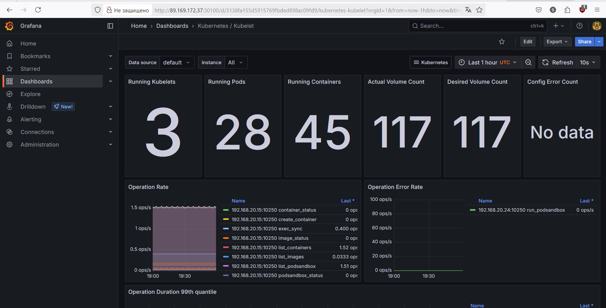
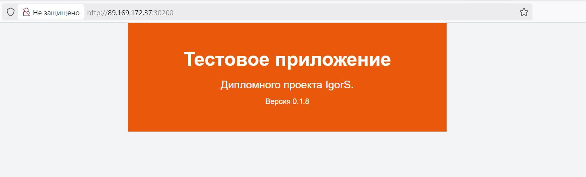

# Дипломный практикум в Yandex.Cloud Шадрин Игорь

## Цели:

[1. Подготовить облачную инфраструктуру на базе облачного провайдера Яндекс.Облако.](#title1)

[2. Запустить и сконфигурировать Kubernetes кластер.](#title2)

[3. Установить и настроить систему мониторинга.](#title3)

[4. Настроить и автоматизировать сборку тестового приложения с использованием Docker-контейнеров.](#title4)

[5. Настроить CI для автоматической сборки и тестирования.](#title5)

[6. Настроить CD для автоматического развёртывания приложения.](#title5)


### <a id="title1">1.Подготовить облачную инфраструктуру на базе облачного провайдера Яндекс.Облако.</a>

Терраформ конфигурация для создания сервисного аккаунта, бакета в YC для хранения стейт файла:

[Бакет](ter-s3)
 
Терраформ конфигурация для создания  основной инфраструктуры - мастер нода и две воркер ноды:

[Инфраструктура](ter-main)


Скриншот созданной инфраструктуры.


Бакет с конфигурацией

### <a id="title2"> 2. Запустить и сконфигурировать Kubernetes кластер. </a>

Конфигурация терраформ генерирует ансибл inventory из темплейт файла

[Сгенерированный файл hosts](ansible/inventory/hosts.yml)


Проверим, что все хосты развернулись и доступны

Плейбук ансибл клонирует на мастер ноду гит репозиторий плейбука Кубспрей для установки кластера, ставит зависимости и менеджер helm, копирует экземпляр хост файла на мастер ноду и закрытую часть ключа для доступа к нодам.

[Плейбук ансибл](ansible/site.yml)

После клонирования кубспрея, на Мастер ноде добавил внешний ip адрес для генерации сертификатов, чтобы github actions имел доступ к мастер ноде - переменная 
```
supplementary_addresses_in_ssl_keys: [84.201.154.151]
```
в файле 
```
./kubespray/inventory/mycluster/group_vars/k8s_cluster/k8s-cluster.yml
```
Далее запуск установки кубспрея:
```
ansible-playbook -i inventory/mycluster/hosts.yml cluster.yml -b -v
```

Удостоверимся, что кластер развернут


### <a id="title3"> 3. Установить и настроить систему мониторинга. </a>

Систему мониторинга Prometheus устанавливаем при помощи helm
```
helm repo add prometheus-community https://prometheus-community.github.io/helm-charts
helm repo update
```
Для проброса порта grafana наружу, делаем правки в файле
```
helm show values prometheus-community/kube-prometheus-stack > ~/values.yaml
```
```
service:
    portName: http-web
    type: NodePort
    nodePort: 30100
```
В этом же файле правим логин и пароль дла доступа к системе мониторинга


Система мониторинга разворачивается


Система мониторинга развернута


Графический интерфейс доступен на ip кластера

### <a id="title4"> 4. Настроить и автоматизировать сборку тестового приложения с использованием Docker-контейнеров. </a>

Сначала соберем тестовое приложение на рабочей машине и запушим его в гит хаб и докер хаб


Сборка приложения


Пуш приложения в докер хаб

Далее формируем yaml файлы для деплоя объектов с тестовым приложением в кубер кластер
[yaml](app_deploy)
Объявлены пространство имен, демонсет с двумя репликами и сервис с пробросом портов наружу

Так же пушим исходники в репозиторий
https://github.com/igors-source/testapp


Приложение развернуто в Кубер кластере

https://hub.docker.com/repository/docker/igorssource/testapp/general
Ссылка на докер хаб с контейнером 

### <a id="title5"> 5,6 Настроить CI CD для автоматической сборки и развёртывания. </a>

Для выполнения пунктов 5 и 6 используется GitHub Actions.


Добавляем секреты в репозиторий с тестовым приложением - 
- USER - аккаунт на докерхабе
- TOKEN - секретный токен докерхаба
- CONFIG - в эту переменную кладем содержимое config файла с мастер - ноды кубер кластера с сертификатами, изменяя ip на внешний ip кластера

Во вкладке Actions, добавляем новое действие 

https://github.com/igors-source/testapp/blob/main/.github/workflows/main.yml

Раздел 
- build проверяет код, устанавливает на раннер докер билдер, логинится на докерхаб, определяет, есть ли тег с новой версией для пуша приложения, собирает и пушит артефакт на докер хаб

Раздел
-deploy зависит от выполнения раздела build, устанавливает раннер kubectl, определяет версию для деплоя, подключается к мастер ноде, 
```
 kubectl set image ds/nginx-app nginx=igorssource/testapp:${{ env.VERSION }} -n application
 ```
и в итоге конфигурирует демонсет, устанавливая образ приложения соответствующий тегу сборки.


До сборки


После сборки


Результат выполнения раннера.


